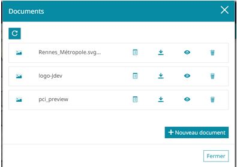

## Vue globale de MapStore2

Vous trouverez ci-dessous une vue globale standard de MapStore2.

Nous nous intéresserons aux éléments 3 et 4 pusiqu'ils vous permettront d'accéder au module de gestion des documents :

## Permettre l'accès au module

Ce module doit être rendu visible par le créateur du contexte. Par défaut, il n'est pas accessible et doit être manuellement ajouté lors de la création du contexte.

Ce module n'est pas activé par défaut.

## Ouvrir le module

Le module est accessible de 2 façons différentes selon la configuration souhaitée par l'administrateur.

### Via la barre d'outils latérale

L'icône peut évoluer selon le choix de l'administrateur.
Par défaut, c'est un dossier avec une flêche :

### Via le bouton burger

Le bouton burger est collé à la barre de recherche en haut à droite (si rendue visible par l'administrateur).

Le bouton d'accès au module est alors visible en tant que "Gérer les documents" dans la liste qui s'affiche après un clique sur le bouton burger :

## Fenêtre du module

Pour une description de la fenêtre principale, dirigez-vous vers la section `fenêtre principale`.

### Utilisateur non administrateur

Si vous n'êtes pas administrateur, vous ne pourrez voir tous les documents du contexte en une seule fenêtre. Vous ne pouvez en effet voir que les documents d'une entité sélectionnées.

A l'ouverture, un utilisateur non administrateur verra cette fenêtre :

Pour voir les documents, dirigez-vous vers la section "Consultation".

### Utilisateur administrateur

Si vous êtes un administrateur, vous pourrez par défaut voir tous les documents dans une seule fenêtre dès l'ouverture :

