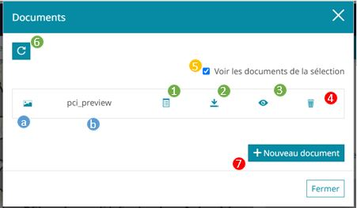
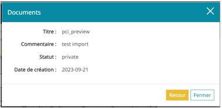
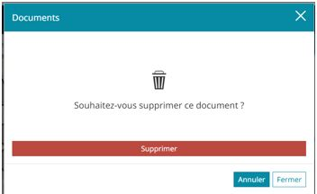

# Fenêtre principale

Le contenu de la fenêtre évolue selon les actions de l'utilisateur.

Nous décrirons les actions et les écrans possibles.

## Vue de la liste documents

Cette écran permet l'affichage des documents et des actions associés.

Pour cette section, vous devez avoir déjà cliqué sur un élément de la carte avec des documents déjà rattaché à l'élément cliqué.

Les actions numérotées sur la capture ci-dessous dépendent de vos droits.

- En rouge : actions qui nécessitent les droits d'édition
- En vert : actions pour tous les utilisateurs
- En bleu : informations générale sur le document
- En orange : actions pour les administrateurs uniquement

### Actions générales

Ces actions sont réalisables par tous les utilisateurs.

- **Action 1** : Afficher les informations

Ce bouton permet d'afficher dans la fenêtre les informations saisies relatives au document.

Les informations visibles dépendent de la configuration choisie par l'administrateur.
L'administrateur peut en effet décider d'afficher moins d'informations.

`Note : Par défaut, les champs saisient sont autoamtiquement affichés dans cette liste.`

- **Action 2** : Télécharger le document

Ce bouton permet de télécharger sur votre ordinateur le document.

- **Action 3** : Voir le document

Ce bouton permet de voir le document dans un nouvel onglet

- **Action 4** : Rechagement de la liste

Ce bouton est utile si un autre utilisateur disposant des droits suffisants rajoute un document après que vous ayez commencé à consulter la liste.

Il permet de recharger la liste des documents à la demande.

### Actions des éditeurs

- **Action 4** : Supprimer un document

Permet de supprimer le document de l'écran et de la base de données.
Au clique sur ce bouton, un écran de confirmation vous permettra d'annuler l'action ou de supprimer définitivement le document.

- **Action 7** : Ajouter un document

Le clique sur ce bouton vous permettra d'accéder à l'interface de saisie d'un document.

### Action administrateur

- **Action 5** : Voir tous les documents

Cette case à cocher est réservée aux administrateurs. Ils pourront alors voir tous les documents du contexte et non pas que les documents de la sélection.

