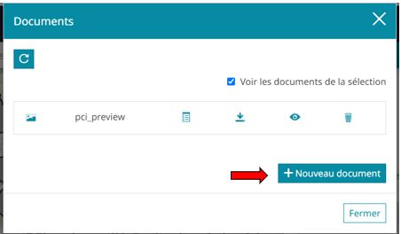
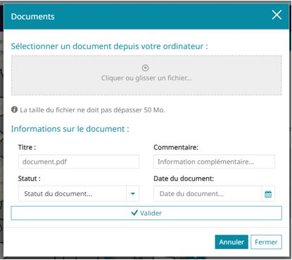

# Ajouter un document

Cette section permet de décrire l'étape d'ajout d'un document.

## Accéder à l'ajout d'un document

Pour ajouter un document, vous devez ouvrir le module et cliquer sur "+ Nouveau document".

## Fenêtre d'ajout d'un document

A l'ouverture la fenêtre se présente comme ceci :

Vous pouvez annuler la création d'un document en cliquant sur **Annuler** ou si vous fermez la fenêtre.

## Champs à renseigner

Les sections qui suivent permettent de décrire les champs à renseigner.

### Zone d'ajout

Pour ajouter un document, vous pouvez choisir les formats image (PNG, JPG...), PDF, CSV, Excel (divers).

Le document ne peut dépasser 50 Mo.

Pour ajouter votre document :

- Glisser le document dans la zone grise

ou

- Cliquez sur la zone grise pour choisir le document

### Titre

Si non renseigné avant l'ajout du document, c'est le titre du fichier qui est récupéré comme titre par défaut.

Vous pouvez alors modifier cette valeur par un titre personnalisé qui sera affiché dans la liste des documents précédente.

**Attention : le titre doit être unique. Une erreur s'affichera si ce n'est pas le cas et vous devrez le modifier !**

### Commentaire

Le commentaire est une courte description textuelle du document.

### Statut

Le statut n'est pas obligatoire et dépend de la configuration du module pour être renseignable.
Par définition, c'est une liste de choix.

### Date du document

C'est la date réelle du document. Il faut alors distinguer la date d'ajout calculée lorsque vous cliquer la date actuelle lorsque vous importez le document et la date réelle, qui est la date connue d'existance du document.

Ex:  J'ajoute le document le 25/09/2023, mais je souhaite renseigner que le document a été réalisé par le service communication le 05/04/2022. Dans ce cas, vous devez saisir le 05/04/2022 dans ce champ pour indiquer la date du document.

### Champs obligatoires

Les champs obligatoires sont définis par l'administrateur et ne sont pas connus à l'avance.
Si un champ non obligatoire n'est pas renseigné, une erreur s'affichera à l'écran lors de la tentative de validation.

## Validation

Le bouton **Valider** n'est pas accessible si :
- un des champs obligatoire n'est pas renseigné
- si la contrainte d'unicité du label n'est pas respectée
- si vous n'avez importé aucun document
- si la taille du document est dépasse les 50 Mo
