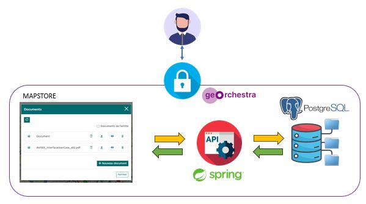

---
hide:
  - navigation
  - toc
---

# Accueil

Docs-manager est un ensemble de brique permettant simplement d'ajouter ou récupérer des documents via une base de données PostgreSQL.

Les briques sont composées de :

- Un service backend / API permettant de dialoguer avec la base de données selon les droits définis par les rôles geOrchestra

- Une extension MapStore2 permettant de lire, écrire, télécharger des documents dans une fenêtre

 

# Sponsors

Cet outil a été réalisé grâce aux besoins et aux financement de [l'ARS Île-de-France](https://www.iledefrance.ars.sante.fr/) et du [GIP SESAN](https://www.sesan.fr/).

| Organisme      | icône                          |
| ----------- | ------------------------------------ |
| [GIP SESAN](https://www.iledefrance.ars.sante.fr/)      |  |
| [GIP SESAN](https://www.sesan.fr/)      |  |

