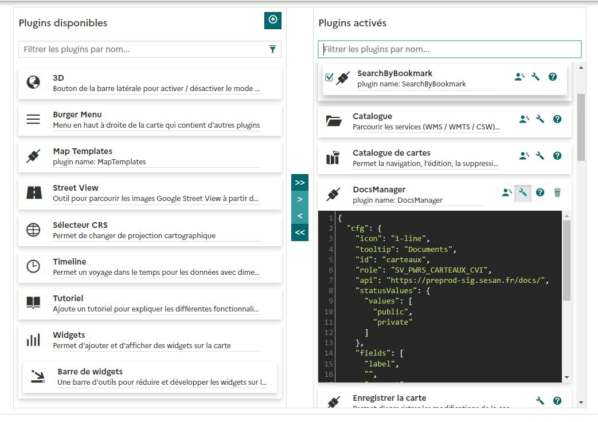

# Configuration

Cette section permettra de comprendre comment configurer le plugin MapStore : docs-manager.

## Ajouter ou modifier la configuration

Dans le menu d'activation des extensions, vous devez identifier dans la colonne de droite le plugin DocsManager.

Cliquer ensuite sur le bouton "Modifier la configuration du plugin" pour accéder à l'interface de saisie des paramètres : 



## Example de configuration

Avant d'expliquer les paramètres, vous trouverez un exemple complet ici : 

```
{
  "cfg": {
    "icon": "1-line",
    "id": "carteaux",
    "editingAllowedRoles": "SV_PWRS_CARTEAUX_CVI",
    "api": "https://gis.jdev.fr/docs/",
    "statusValues": {
      "values": [
        "public",
        "private"
      ]
    },
    "fields": [
      "label",
      "",
      "comment",
      "status",
      "dateDoc"
    ],
    "requiredFields": [
      "label"
    ],
    "entity": {
      "plugin": "d2t",
      "propCfg": "feature",
      "attribute": "id"
    }
  },
  "override": {}
}
```

## Paramètres

- **icon** : icône visible dans mapstore pour le bout d'activation du module
- **id** : code (ou identifiant) à utiliser pour regrouper les documents par contexte (ou par application)
- **editingAllowedRoles** : rôle geOrchestra qui peut écrire (selon la configuration backend) en plus des administrateurs
- **api** : chemin vers le backend
- **statusValues.values** : liste de valeurs permettant d'ajouter un statut à un document (liste libre non relationnelle)
- **fields** : champs saisissable à l'ajout d'un document. Ces champs seront également visibles pour chaque documents. Les valeurs possibles de la liste sont sont : ``label | comment | status | dateDoc``.
- **requiredFields** : champs obligatoires parmis la liste précédente.
- **entity** : Objet permettant de configurer le lien entre une entité sélectionnée et un document.
- **entity.plugin** : permet de rechercher dans le state d'un plugin selon son identifiant mapstore.
- **entity.propCfg** : Propriété du plugin contenant les propriétés de l'objet sélectionné.
- **entity.attribute** : Champ contenant l'attribut à utiliser dans les propriétés de l'objet sélectionné.