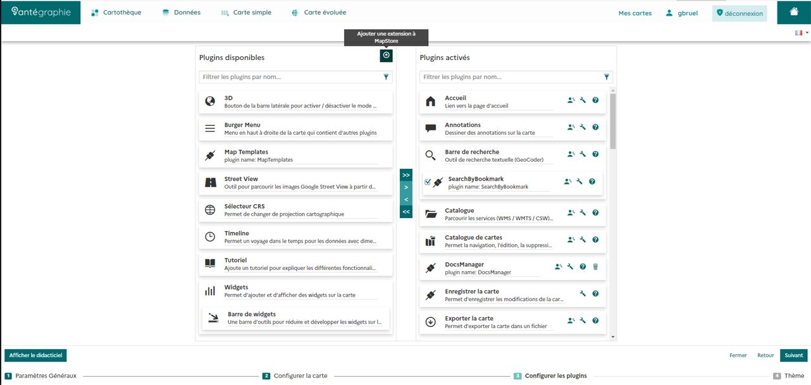
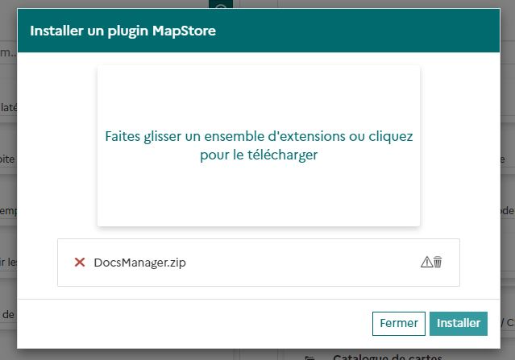

# Installation

Cette section vous permettra d'installer le module MapStore2 : docs-manager.

## Prérequis

- Vous devez disposer du fichier format .ZIP du plugin permettant de l'importer dans MapStore.
- Vous devez disposer des droits d'édition d'un contexte pour y ajouter un module supplémentaire ou modifier les modules à utiliser dans le context à éditer

## Récupérer le fichier

Le fichier (.zip) est disponible dans GitHub :

- [Dans les releases (par version)](https://github.com/jdev-org/docs-manager-front/releases)
- [dans les actions GitHub](https://github.com/jdev-org/docs-manager-front/actions)

## Ajouter le module dans MapStore2

Lorsque vous êtes en mode édition dans un contexte, vous devez cliquer sur "Ajouter une extension" :

Importer ou faire glisser ensuite le ZIP :

Cliquer ensuite sur "Installer".

Le plugin est maintenant disponible dans la colonne de gauche. Aidez-vous des flêches pour ajouter activer un plugin en le rajouter dans la colonne de droite.

Votre plugin et maintenant installé et activé. Il vous restera à le configurer.

